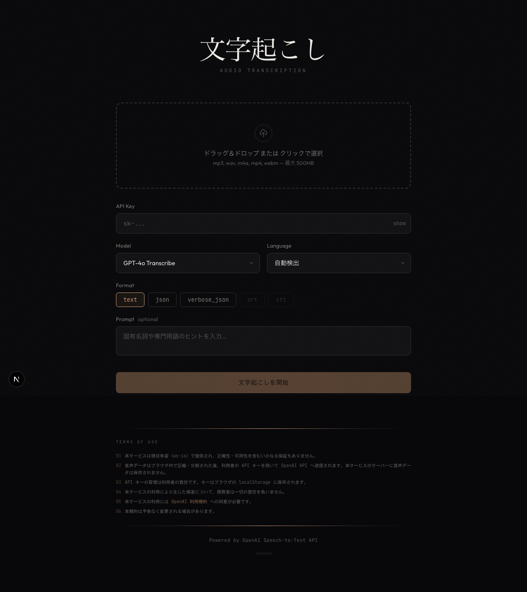

# mojiokoshi

[](https://nextjs.org/)
[](https://react.dev/)
[](https://www.typescriptlang.org/)
[](https://tailwindcss.com/)
[](https://platform.openai.com/docs/guides/speech-to-text)
[](#license)

> **[日本語版 README はこちら](README.ja.md)**

A minimal web application for audio transcription using [OpenAI Speech-to-Text API](https://platform.openai.com/docs/guides/speech-to-text).

Upload an audio file, provide your OpenAI API key, and get a transcription back in plain text, JSON, SRT, or VTT format.



## Features

- Drag & drop or click-to-upload audio files (mp3, wav, m4a, mp4, webm, ogg, flac — up to 500MB)
- Large file support: files over 25MB are automatically compressed and split using [ffmpeg.wasm](https://ffmpegwasm.netlify.app/) (runs entirely in the browser)
- Chunked transcription with context carryover for accurate results across splits
- Real-time progress display during compression, splitting, and transcription
- Cancellable processing at any stage
- Model selection: GPT-4o Transcribe, GPT-4o Mini Transcribe, Whisper-1
- Multiple output formats: text, json, verbose_json, srt, vtt
- SRT/VTT timestamp offsetting for correct timing across chunks
- Language detection (auto or manual selection from 11 languages)
- Optional prompt for domain-specific vocabulary hints
- API key stored locally in browser (sent only to OpenAI via server-side proxy)
- One-click copy of transcription results

## Tech Stack

- [Next.js 15](https://nextjs.org/) (App Router)
- [React 19](https://react.dev/)
- [Tailwind CSS 3](https://tailwindcss.com/)
- [ffmpeg.wasm](https://ffmpegwasm.netlify.app/) (client-side audio processing)
- TypeScript

## Getting Started

```bash
# Install dependencies
npm install

# Start development server
npm run dev
```

Open [http://localhost:3000](http://localhost:3000) in your browser.

You will need an [OpenAI API key](https://platform.openai.com/api-keys) to use the transcription feature.

## Deployment

This app can be deployed to [Vercel](https://vercel.com) with zero configuration:

[](https://vercel.com/new/clone?repository-url=https://github.com/loppo-llc/mojiokoshi)

## License

This project is proprietary software. All rights reserved by [loppo LLC](https://github.com/loppo-llc). Unauthorized copying, modification, or distribution is prohibited.
